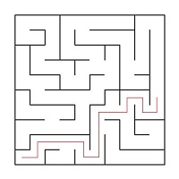
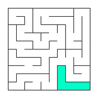

Десктопное приложение, в котором выполняется генерация, отрисовка и решение лабиринтов

## Примененные технологии
* C++
* QT (GUI)
* clang-format (style testing)
* QCustomPlot (graph lib)
* Makefile

## Примененные паттерны
* MVC
* Facade
* Singleton

## Содержание

1. [Вступление](#Вступление)
2. [Информация](#Информация)
3. [Part 1](#part-1-реализация-проекта-maze)
4. [Part 2](#part-2-генерация-идеального-лабиринта)
5. [Part 3](#part-3-решение-лабиринта)

## Вступление

В данном проекте мы познакомились с лабиринтами, а также основными алгоритмами их обработки,
такими как: генерация, отрисовка, поиск решения.

## Информация

Лабиринт с "тонкими стенками" представляет собой таблицу размером _n_ строк на _m_ столбцов. Между ячейками таблицы
могут
находиться "тонкие перегородки". Также "тонкими стенками" окружена вся таблица в целом.

Вот пример такого лабиринта:


Решение лабиринта представляет собой кратчайший путь от начальной точки до конечной, при условии, что можно перемещаться
только к соседним ячейкам, не отделенным "тонкой стеной", и находящимся сверху, снизу, справа или слева от текущей
ячейки. Кратчайшим маршрутом считается тот, который проходит через наименьшее количество ячеек.

Пример лабиринта с его решением:


В этом примере начальная точка задана, как 10; 1, а конечная, как 6; 10.

## Описание лабиринта

Лабиринт может быть представлен в файле следующим образом, включая количество строк и столбцов, а также две матрицы,
указывающие наличие вертикальных и горизонтальных "тонких стен" (перегородок) между ячейками.

Пример такого файла:

```
4 4
0 0 0 1
1 0 1 1
0 1 0 1
0 0 0 1

1 0 1 0
0 0 1 0
1 1 0 1
1 1 1 1
```

Лабиринт, описанный в этом файле: \


## Недостатки лабиринтов

Изолированная область в лабиринте - это часть лабиринта с проходами, к которой невозможно достичь из оставшейся части
лабиринта. Это может создать ситуацию, в которой некоторая область лабиринта оказывается отделенной и недоступной для
перемещения между другими областями лабиринта.

Пример изолированной области в лабиринте:


Петля в лабиринте - это часть лабиринта с проходами, по которым можно перемещаться "кругами", то есть зацикливаться, не
находя выхода. В петлях стены не соединены со стенами, окружающими лабиринт, что создает возможность бесконечных
циклических перемещений.

Пример петли в лабиринте:


## Part 1. Реализация проекта Maze

- Программа была реализована на языке C++ стандарта C++17.
- Код программы находится в папке src и соблюдает стиль оформления Google Style.
- Для сборки программы использован Makefile со стандартным набором целей для GNU-программ: all, install, uninstall,
  clean, dvi, dist, tests.
- В программе реализован графический пользовательский интерфейс на базе GUI-библиотеки с API для C++ Qt.
- Присутствует функциональность загрузки лабиринта из файла в формате, описанном ранее.
- Максимальный размер лабиринта составляет 50x50.
- Загруженный лабиринт отрисовывается на экране в области размером 500 x 500 пикселей.
- Толщина стен установлена в 2 пикселя.
- Размер ячеек лабиринта вычисляется так, чтобы лабиринт занимал всё доступное под него поле.

## Part 2. Генерация идеального лабиринта

Добавлена возможность автоматической генерации идеального лабиринта. \
Идеальным считается лабиринт, в котором из каждой точки можно попасть в любую другую точку ровно одним способом.

- Лабиринт генерируется согласно **алгоритму Эллера**
- Сгенерированный лабиринт не имеет изолированных областей и петель
- Обеспечено полное покрытие unit-тестами модуля генерации идеального лабиринта
- Пользователем вводится только размерность лабиринта: количество строк и столбцов
- Сгенерированный лабиринт сохраняться в файл в формате, описанном [выше](#описание-лабиринта)
- Созданный лабиринт отображаться на экране как указано в [первой части](#part-1-реализация-проекта-maze)

## Part 3. Решение лабиринта

Добавлена возможность показать решение _любого_ лабиринта, который сейчас изображен на экране:

- Пользователем задаются начальная и конечная точки
- Маршрут, являющийся решением, отображен линией толщиной 2 пикселя, проходящей через середины всех ячеек лабиринта,
  через которые пролегает решение
- Цвет линии решения является отличным от цветов стен и поля
- Обеспечено полное покрытие unit-тестами модуля решения лабиринта

